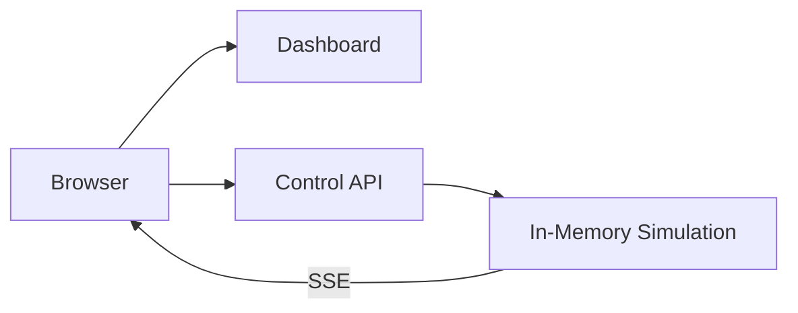
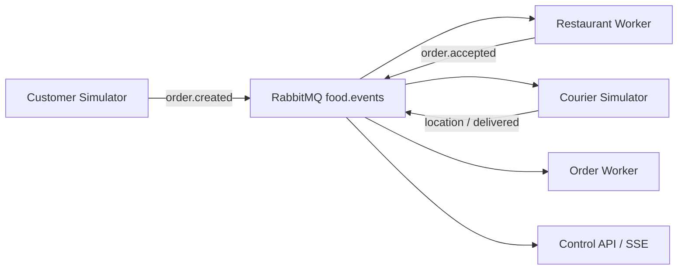

# Architektur

## Block 3: Standalone

Das Dashboard und die Control API laufen als getrennte Deployments. Die Control API besitzt vorerst den In-Memory-Zustand und führt die Simulation aus.

Die bewusste Einschränkung ist sichtbar: `control-api` darf noch nicht horizontal skaliert werden. Mehrere Replicas hätten voneinander abweichende Zustände. Messaging und Persistenz lösen dies in späteren Blöcken.

## Block 4: Ingress und Load Balancing

Traefik veröffentlicht Dashboard und API unter einem gemeinsamen Einstiegspunkt:

- `/` wird zum `dashboard`-Service geroutet.
- `/api`, `/health` und `/metrics` werden zum `control-api`-Service geroutet.
- Zwei Dashboard-Pods zeigen das Load Balancing des Services.
- Die Control API bleibt wegen des In-Memory-Zustands bei einer Replica.

## Block 5: Messaging

RabbitMQ entkoppelt die fachliche Verarbeitung:

Die Verarbeitung ist at-least-once. Der Order Worker besitzt in diesem Block nur einen lokalen Idempotenzspeicher. Ein Pod-Neustart zeigt deshalb bewusst die noch offene Persistenzlücke.

## Block 6: CloudNativePG und Persistenz

Der Order Worker ist der einzige Schreiber des fachlichen Zustands. Er verarbeitet jedes Event mit einer PostgreSQL-Transaktion:

1. `event_id` in `processed_events` beanspruchen.
2. Fachliche Zustandsänderung projizieren.
3. Relevantes Event in `order_events` ablegen.
4. Transaktion committen und erst danach die RabbitMQ-Nachricht bestätigen.

Die Anwendungen verwenden den von CloudNativePG verwalteten `food-delivery-db-rw`-Service. Dieser zeigt nach einem Failover automatisch auf den neuen Primary.

## Block 7: Resilienz, Skalierung und Observability

Im letzten Ausbauschritt wurde das Verhalten der Anwendung im laufenden Betrieb untersucht.

### Readiness

Bei einem simulierten Readiness-Ausfall blieb der betroffene Pod zwar im Zustand `Running`, wechselte jedoch von `1/1` auf `0/1`. Kubernetes entfernte den nicht bereiten Pod aus den erreichbaren Endpoints. Der zweite Pod blieb weiterhin verfügbar.

### Fehlerhaftes Deployment

Für die Simulation eines fehlerhaften Updates wurde absichtlich das ungültige Image `nginx:absichtlich-falsch` verwendet. Der neue Pod wechselte dadurch in den Zustand `ErrImagePull` beziehungsweise `ImagePullBackOff`.

Die bestehenden funktionsfähigen Pods blieben weiterhin verfügbar. Mit `kubectl rollout undo` wurde anschliessend der vorherige funktionierende Stand wiederhergestellt.

### Horizontal Pod Autoscaler

Mit dem Horizontal Pod Autoscaler wurde die automatische Skalierung unter Last getestet. Die CPU-Auslastung stieg während des Tests deutlich an. Kubernetes skalierte die Anwendung automatisch von zwei auf vier Replicas.

Nach Ende der Last sank die CPU-Auslastung wieder und die Anzahl Replicas wurde automatisch auf zwei reduziert.

### Monitoring mit Grafana

Grafana wurde für die Beobachtung des Systems verwendet. Das Dashboard `Dispatch City – Betrieb` zeigt unter anderem:

- offene Bestellungen
- gelieferte Bestellungen
- verfügbare Worker
- wartende RabbitMQ-Nachrichten
- verarbeitete Events pro Sekunde

Damit können sowohl der Zustand der Anwendung als auch Veränderungen unter Last beobachtet werden.
